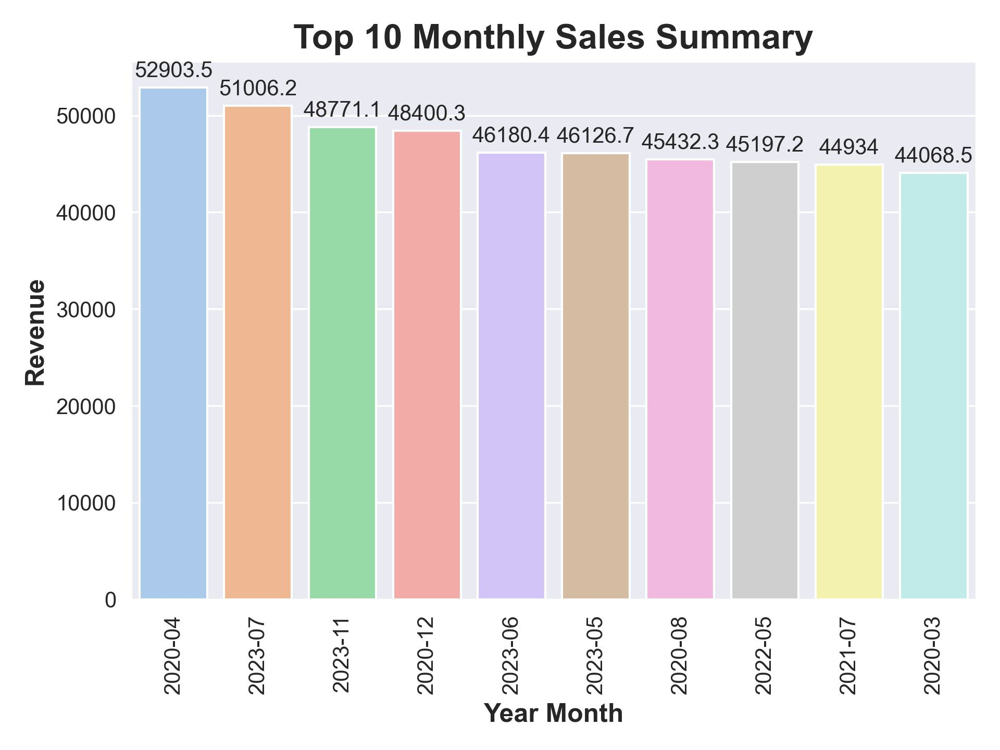
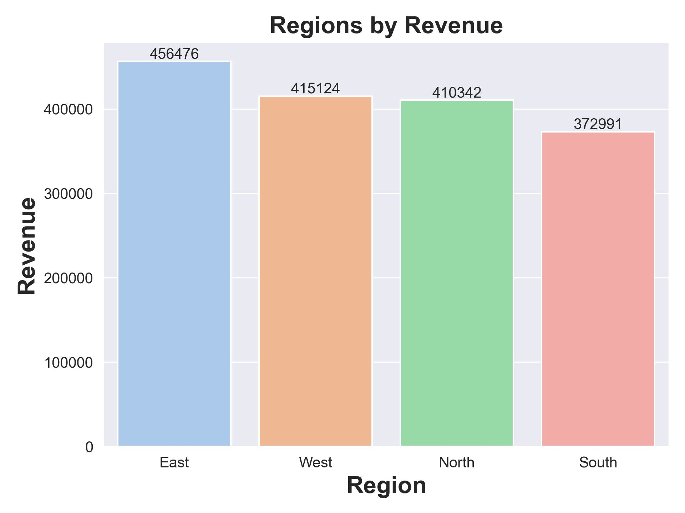
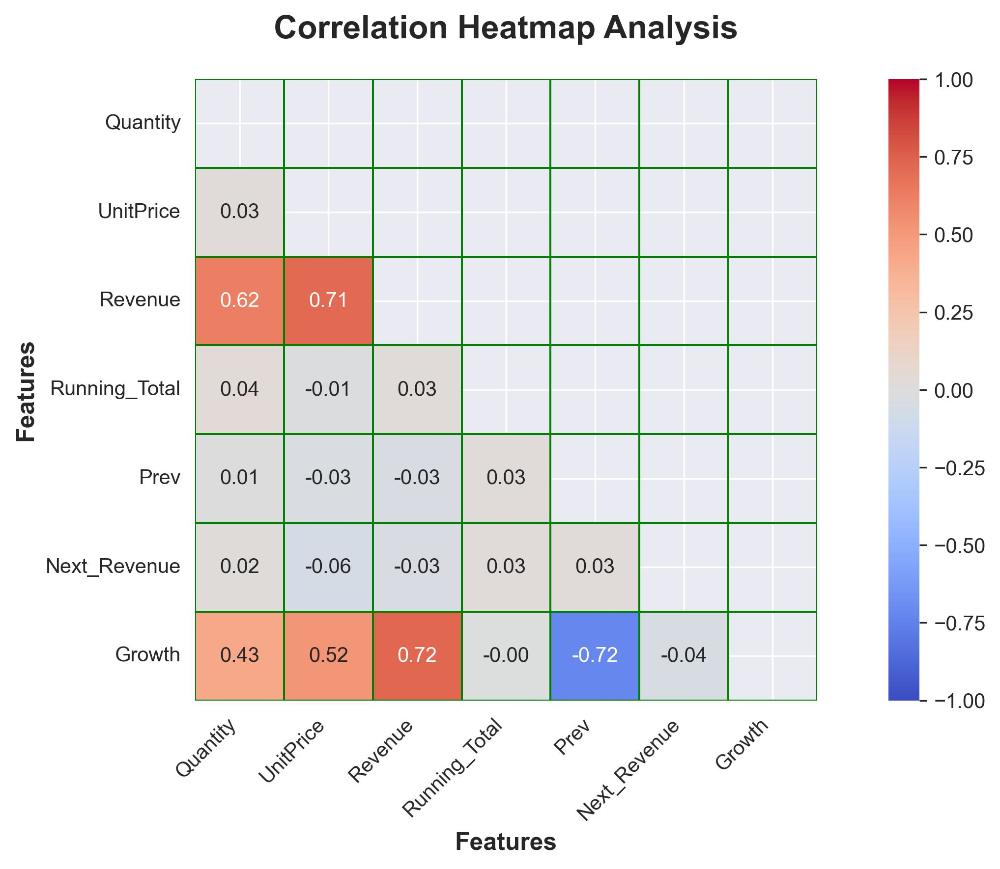

# E-Commerce Sales Analysis

## Overview 
Analysis of E-Commerce sales data to identify revenue trends, customer behavior, product performance and regional insights. 

## Tools 
- Python (Pandas,Seaborn and Matplotlib)
- SQL
- Jupyter Notebook

## Dataset 
- preproject.csv - Raw Dataset 
- clean_project_data.csv - Cleaned Dataset

## Key Findings 
- Monthly sales trend shows seasonal patterns
- Revenue varies significantly across regions
- Top 10 customers contribute major revenue share
- Top 10 products drive most sales
- Price vs Quantity shows inverse relationship
- Revenue outliers detected and analyzed

## Project Structure 
- raw_data_analysis_of_project.ipynb - Raw EDA
- advanced_analysis_project.ipynb - Advanced Analysis
- project.sql - SQL queries
- clean_project_data.csv - Cleaned dataset

## Analysis Visualizations 
### Monthly Sales Summary 

### Regions by Revenue

### Correlation Heatmap 

